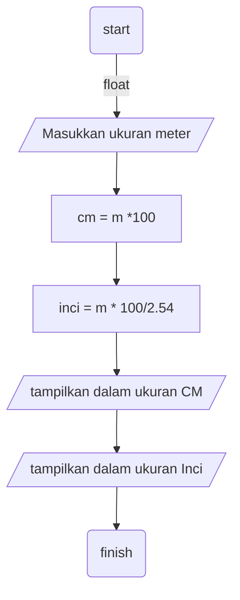

```mermaid
    flowchart TD;
    A(start) --float--> B[/Masukkan ukuran meter/];
    B --> C[cm = m *100];
    C --> D[inci = m * 100/2.54];
    D --> E[/tampilkan dalam ukuran CM/];
    E --> F[/tampilkan dalam ukuran Inci/];
    F --> G(finish);
```
