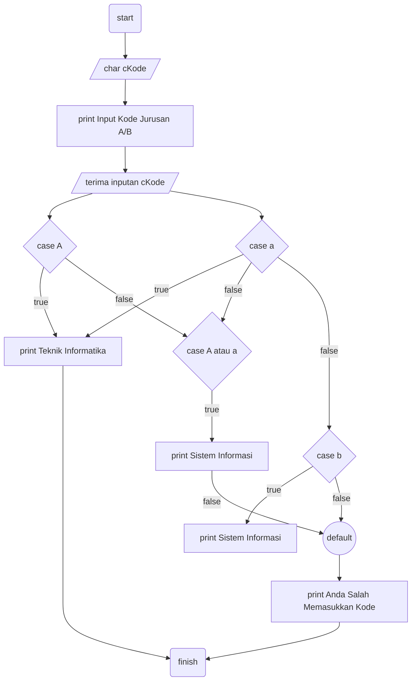

```mermaid
flowchart TD;
A(start) --> B[/char cKode/];
B --> C[print Input Kode Jurusan A/B ];
C --> D[/ terima inputan cKode /];
D --> E{case A};
D --> F{case a};
E --true--> G[print Teknik Informatika];
F --true--> G[print Teknik Informatika];
E & F --false--> H{case A atau a}
F --false--> I{case b};
H --true--> J[print Sistem Informasi];
I --true--> K[print Sistem Informasi];
J --false--> L((default));
I --false--> L((default));
L --> M[print Anda Salah Memasukkan Kode];
M & G --> N(finish);

```
