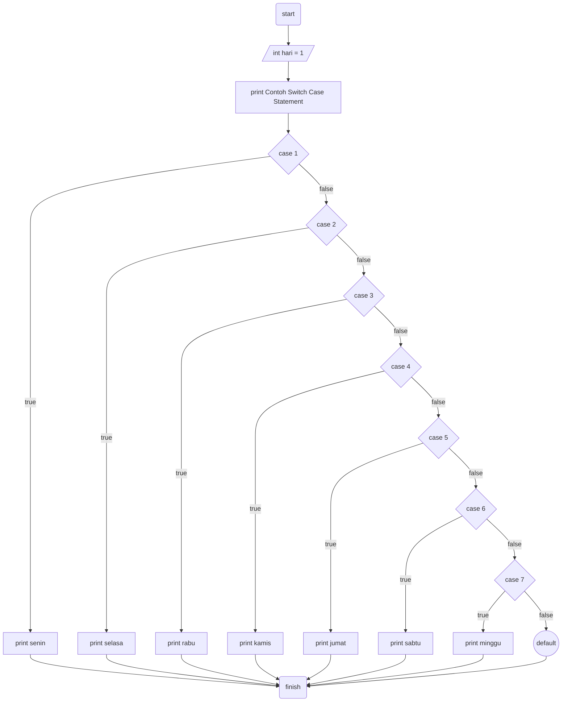

```mermaid
 flowchart TD;
 A(start) --> B[/int hari = 1/];
 B --> C[print Contoh Switch Case Statement];
 C --> D{case 1};
 D --true--> E[print senin];
 D --false--> F{case 2};
 F --true--> G[print selasa];
 F --false--> H{case 3};
 H --true--> I[print rabu];
 H --false--> J{case 4};
 J --true--> K[print kamis];
 J --false--> L{case 5};
 L --true--> M[print jumat];
 L --false--> N{case 6};
 N --true--> O[print sabtu];
 N --false--> P{case 7};
 P --true--> Q[print minggu];
 P --false--> R((default));
 E & G & I & K & M & O & Q & R --> S(finish);

```
